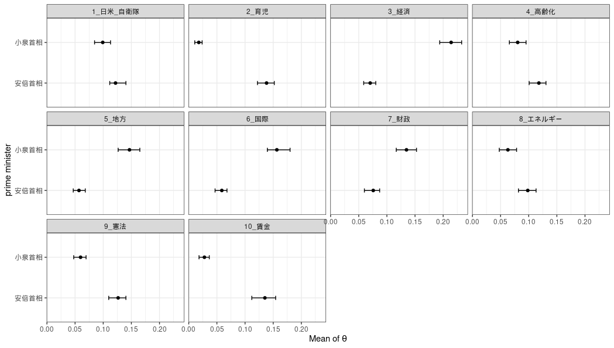
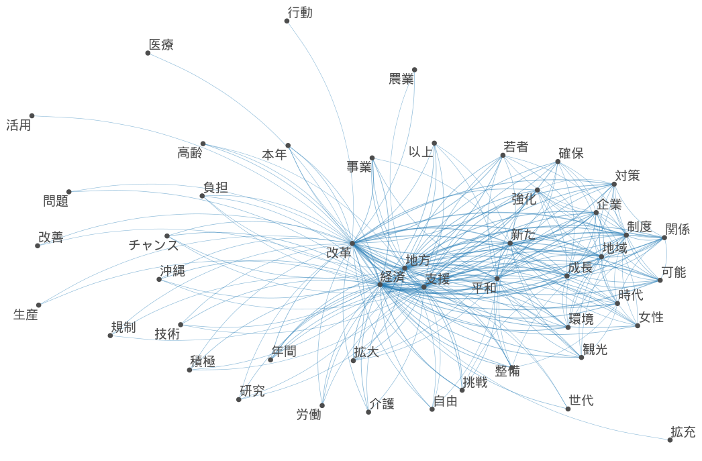
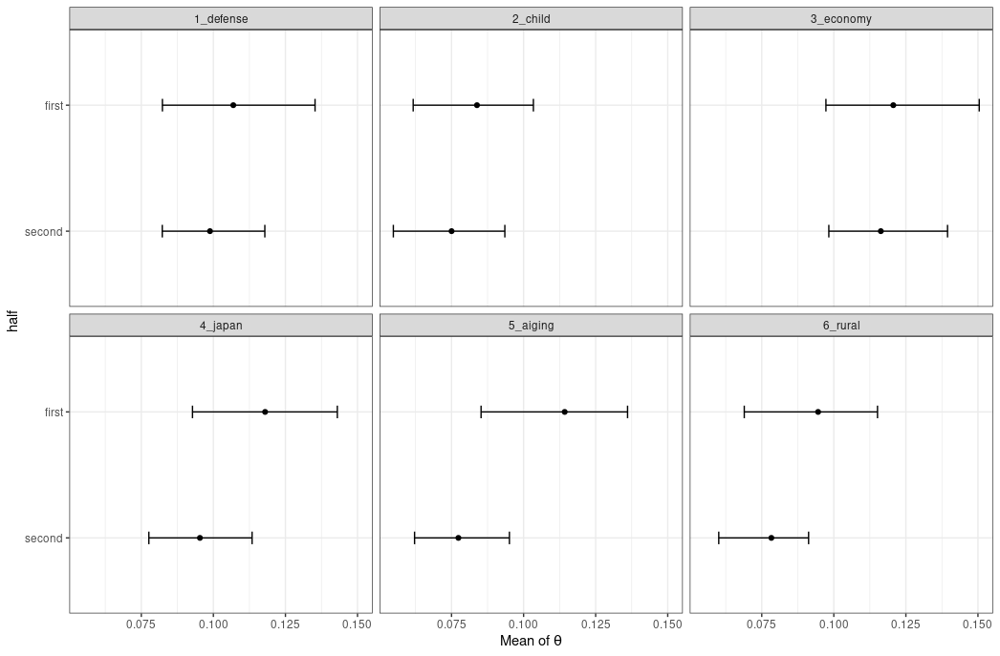
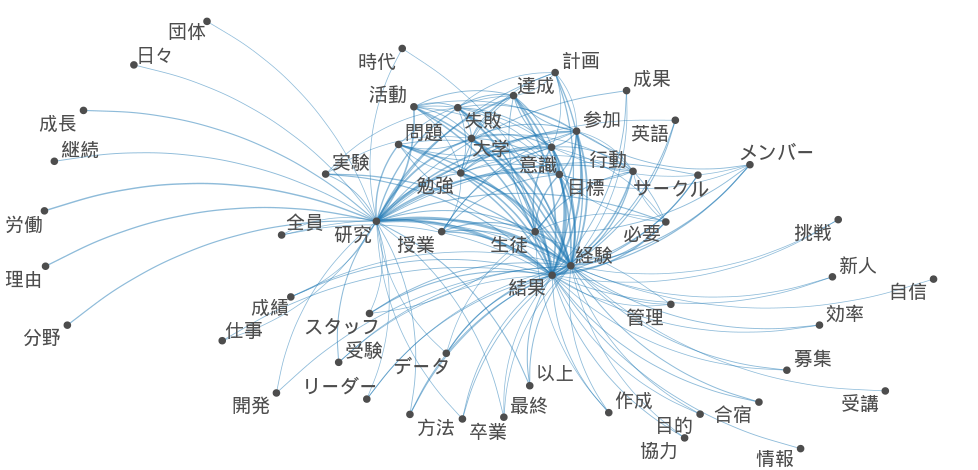
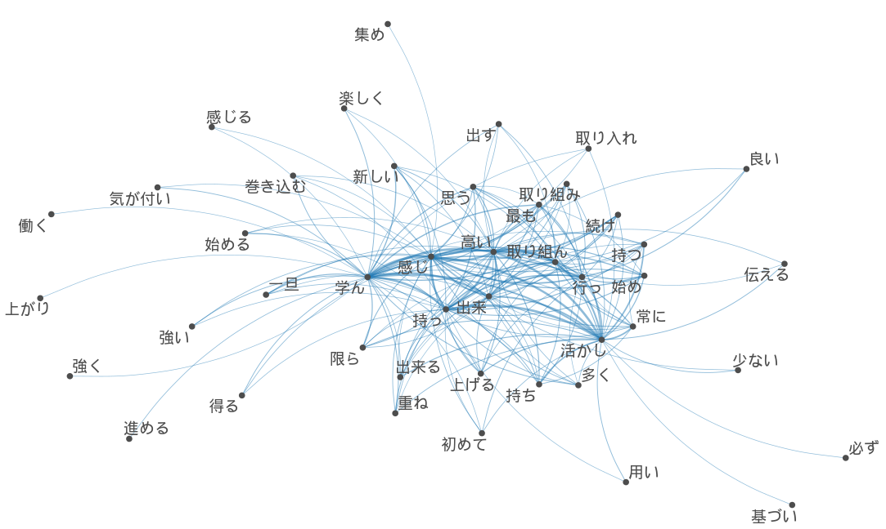
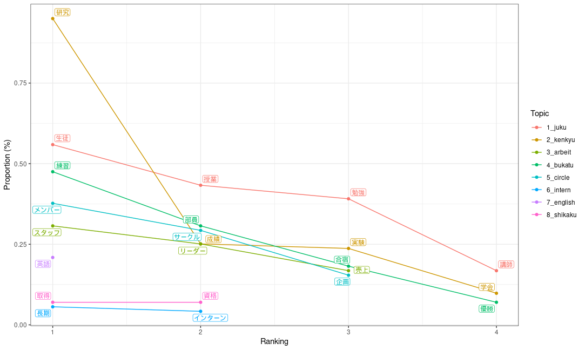

# トピックモデル実装

## 首相所信表明/施政方針演説比較

```{r ,echo=TRUE,include=TRUE,warning=FALSE,error=FALSE,message=FALSE,,class.source="fold-show"}
library(keyATM)
library(quanteda)
library(summarytools)
library(readtext)
library(dplyr)
library(RcppMeCab)
load("data/RData/topic.RData")
```

### 形態素解析からdfm形式へ変換

・Windowsでは文字化けするのでUbuntu22.04上で操作

・計24回の演説を分析

・形態素解析には{RcppMeCab}を使用

・{quanteda}でdfm形式へ変換

```{r,eval=F,echo=T}
#安倍首相演説
shinzopos <- posParallel(shinzo, format = "data.frame")

shinzonoun <- subset(shinzopos, pos == "名詞")

class(shinzonoun) <- "spacyr_parsed"

shinzonoun <- as.tokens(shinzonoun)

names(shinzonoun) <- names(shinzo) 

head(shinzonoun)

shinzodfm <- dfm(shinzonoun)

shinzodfm <- dfm_select(shinzodfm, min_nchar = 2) 

shinzodfm <- dfm_remove(shinzodfm, '^[ぁ-ん]+$', valuetype = 'regex') 
#小泉首相演説
koizumipos <- posParallel(koizumi, format = "data.frame")

koizuminoun <- subset(koizumipos, pos == "名詞")

class(koizuminoun) <- "spacyr_parsed"

koizuminoun <- as.tokens(koizuminoun)

names(koizuminoun) <- names(koizumi) 

koizumidfm <- dfm(koizuminoun)

koizumidfm <- dfm_select(koizumidfm, min_nchar = 2) 

koizumidfm <- dfm_remove(koizumidfm, '^[ぁ-ん]+$', valuetype = 'regex') 
```

#### 結合させて共変量追加

```{r,eval=F,echo=T}
prime<-rbind(koizumidfm,shinzodfm)

docvars(prime,"diff")<-c(rep(0,10),rep(1,14))

vars <- docvars(prime)

primeatm <- keyATM_read(texts = prime)
```

### Topic

・{keyAtm}にてKeywords Assisted Topic modelを動かす

・キーワードをリスト型で指定し、考慮できる新型のLDAモデル

・社会科学分野での応用が期待される

```{r,eval=F,echo=T,class.source="fold-show"}
keywords <- list(日米_自衛隊=c("自衛","米国","防衛","同盟","自衛隊"),
                 育児= c("子供","子ども","女性","教育","育児"),
                 経済=c("経済","産業","成長","民間","企業"),
                 高齢化=c("高齢","福祉","保障","医療","介護"),
                 地方=c("地方","過疎","移転"),
                 国際=c("世界","国際","協力","平和","外交"),
                 財政=c("財政","黒字","健全"),
                 エネルギー=c("原発","環境","エネルギー"),
                 憲法=c("憲法","改正"),
                 賃金=c("賃金","賃上げ","所得","格差"))
```

### 小泉元首相と安倍元首相比較

```{r,eval=F,echo=T}
outcome <- keyATM(docs              = primeatm,
              no_keyword_topics = 0,
              keywords          = keywords,
              model             = "covariates",
              model_settings    = list(covariates_data    = vars,
                                       covariates_formula = ~ diff),
              options           = list(seed = 250))

strata <- by_strata_DocTopic(outcome, by_var = "diff",
                                   labels = c("小泉首相", "安倍首相"))

fig <- plot(strata, var_name = "prime minister", show_topic = 1:11)

fig
```

・小泉首相が特に多く言及するトピックは経済、地方、国際、財政である。やはり聖域なき構造改革、三位一体改革等の経済、行政改革による財政健全化を行っていたことから整合的である。

・一方安倍首相が比較して多く言及しているのは育児、高齢化、憲法と賃金である。小泉首相があまり育児政策や高齢化政策に重きを置かなかったことが要因と思われる。また、憲法と賃金問題を特に争点にしていたことは記憶に新しい。



### 安倍晋三元首相演説



### トピック比率

```{r,eval=F,echo=T}
keywords <- list(defense=c("自衛","米国","防衛","同盟","自衛隊"),
                 child= c("子供","子ども","女性","教育","育児"),
                 economy=c("経済","産業","成長","改革","企業"),
                 japan= c("国家","日本","我が国","国民"),
                 aiging=c("高齢","福祉","保障","医療","介護"),
                 rural=c("地方","地域","創生","過疎","環境"))

key_viz <- visualize_keywords(docs = shinzoatm, keywords = keywords)

key_viz
```


### 前期/後期でのトピックの移り変わり

```{r,eval=F,echo=T}
len<-c(0,0,0,0,0,0,0,1,1,1,1,1,1,1)

docvars(shinzodfm,"half")<-len

head(model.matrix(~ half, data = vars))

out <- keyATM(docs              = shinzoatm,
              no_keyword_topics = 5,
              keywords          = keywords,
              model             = "covariates",
              model_settings    = list(covariates_data    = vars,
                                       covariates_formula = ~ half),
              options           = list(seed = 250))

covariates_info(out)
used_covariates <- covariates_get(out)
head(used_covariates)

strata_topic <- by_strata_DocTopic(out, by_var = "half",
                                   labels = c("first", "second"))

fig_doctopic <- plot(strata_topic, var_name = "half", show_topic = c(1,2,3,4,5,6))

fig_doctopic
```



## 業界ES分析 {.row}

### 名詞共起ネットワーク {.col-md-6}

{width="1200"}

### 動詞・副詞・形容詞 {.col-md-6}

{width="1200"}

### Topic proportion



### Keyword assisted topic

```{r,message=FALSE,warning=F}
top_words(out2)
```
