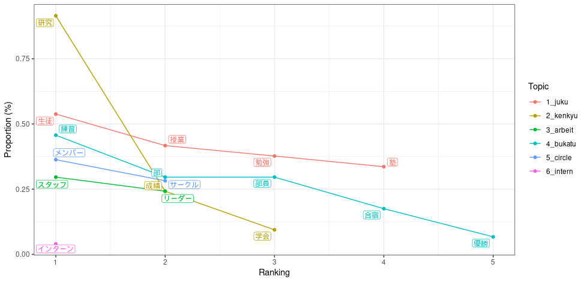

# トピックモデル実装

Windowsでは文字化けするので*ubuntu22.04*上で操作




```{r ,echo=TRUE,include=TRUE,warning=FALSE,error=FALSE,message=FALSE}
library(keyATM)
library(tidyverse)
library(quanteda)
library(tidyverse)
library(summarytools)
library(readtext)
load("data/RData/ESanalysis.RData")
```

```{r,message=FALSE,warning=F}
ES_docs <- keyATM_read(texts = EStxt3)
ESvis <- visualize_keywords(docs = ES_docs, keywords = keywords)
```
